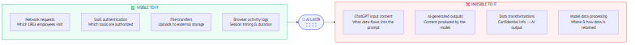
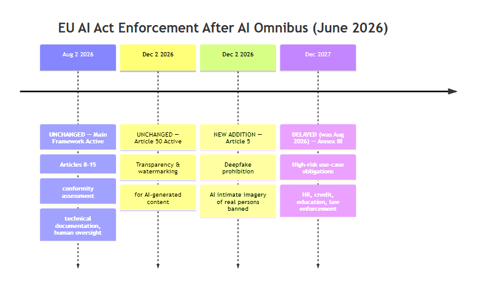
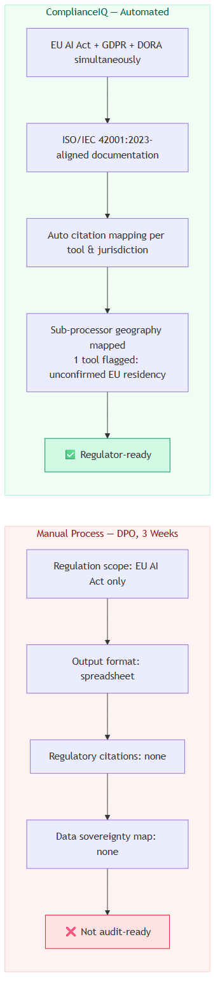
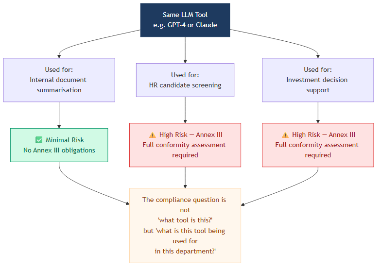

I spent February through April 2026 building ComplianceIQ — an AI governance platform for a major European telecom, developed during the EDHEC Ethical AI Start-Up Challenge. I went in assuming the hard part of EU AI Act compliance was understanding the law.

It isn't. The regulation — 458 pages, Regulation EU 2024/1689 — is dense but navigable. What it doesn't prepare you for is the gap between what the regulation *assumes* about enterprise AI use and what enterprise AI use actually looks like.

Three things I didn't fully understand until we started building.

---

## Your IT Team Is Blind to What Actually Matters

Enterprise IT infrastructure is excellent at monitoring *behavior* and structurally blind to *AI outputs*.

Your organization almost certainly knows which websites employees visit, which SaaS tools are authorized, which files are transferred externally. Network monitoring, DLP tools, browser logs — this layer is mature and comprehensive.

AI changes the unit of risk in a way these tools don't address.

When an employee pastes a client contract into ChatGPT, the network request is visible. The content — the confidential terms, the client name, the transaction details — is not. When an AI synthesizes proprietary sources into a Word document, nothing in the monitoring stack flags that as a data event. The information hasn't moved; it's been *transformed*, and the transformation is invisible.

*IT infrastructure captures behavior reliably. The AI processing layer sits outside its visibility entirely.*

This has a name now: Shadow AI. A 2025 Menlo Security study found that 52% of knowledge workers use personal AI tools at work, and 52% actively conceal this from IT. That isn't recklessness — it's a rational response to misaligned incentives. Employees capture the productivity benefit immediately. The regulatory exposure sits with the organization, not the individual.

Article 50 of the EU AI Act — one of the few enforcement dates that hasn't shifted, effective December 2, 2026 — mandates transparency and watermarking for AI-generated content. But Article 50 addresses the *output* side. It doesn't solve the *input* side: what data flows into the AI tools employees are using ad hoc, outside any IT-sanctioned pipeline.

When we designed ComplianceIQ's detection layer, the browser extension could flag when employees accessed known AI tools. What it couldn't do was classify the *specific use* in any given session — whether that ChatGPT conversation was drafting a marketing email or processing client financial data. That distinction determines regulatory exposure. It's the one that technical infrastructure alone cannot make.

---

## Brussels' Retreat Signals Pragmatism, Not Weakness

On May 7, 2026, the AI Omnibus pushed the compliance deadline for Annex III high-risk systems from August 2026 to December 2027 — sixteen months of additional runway for HR, credit scoring, education, and law enforcement AI obligations.

The industry reaction was mostly relief. The predictable framing: Brussels blinks, innovation wins.

That reading misses what actually happened.

*What changed and what didn't. The main framework activates on schedule; Annex III use-case obligations shifted.*

The Omnibus didn't weaken the substantive obligations of the Act. It delayed their operational deadline — a meaningful distinction. The August 2, 2026 activation of Articles 8–15 (conformity assessment, technical documentation, human oversight) proceeds on schedule. What moved was the secondary layer of use-case obligations, because the Commission acknowledged the technical standards required for compliance weren't ready in time for organizations to actually comply.

That's not capitulation. That's regulatory competence.

There's also structural logic in the delay. If strict enforcement in August 2026 primarily results in European enterprises choosing American AI providers — Copilot, ChatGPT Enterprise, Claude — because those providers have compliance infrastructure and European AI startups don't, then enforcement actually undermines European AI sovereignty. The Brussels Effect works by exporting regulatory standards globally as multinationals adopt EU-level compliance everywhere they operate. That mechanism requires a viable European AI sector to function.

The Omnibus also added something that received less coverage than the delay: a new prohibition under Article 5, effective December 2, 2026, explicitly banning AI systems that generate or manipulate realistic intimate depictions of real people without consent. Brussels wasn't softening the regulation — it was recalibrating enforcement focus toward what's both most harmful and most operationally feasible.

For enterprises we were modeling for, the Omnibus changes the timeline, not the destination. December 2027 is eighteen months closer than it sounds when you're building governance infrastructure from scratch.

---

## Governance Is Infrastructure, Not Overhead

The standard enterprise AI risk framing: adoption creates efficiency gains but also regulatory exposure, so balance the benefits against the costs.

That framing treats compliance as a cost that partially offsets the efficiency benefit. The more useful frame: *ungoverned AI adoption creates a specific class of liability that governed adoption doesn't*, and the question isn't whether to spend on governance but whether to spend before or after an incident.

IBM's 2024 research puts a number on the "after": $670,000 in additional breach costs per Shadow AI incident. EU AI Act violations carry penalties up to €30 million or 6% of global annual revenue. Against those numbers, governance infrastructure looks different.

*A French asset management firm, 5 AI tools, two approaches to compliance documentation.*

The reference scenario that clarified this most sharply: a mid-market French asset management firm managing five AI tools in active use — Copilot, ChatGPT Enterprise, Notion AI, a document analysis tool, a portfolio screening system. The DPO had spent three weeks manually contacting vendors and building a spreadsheet. No regulatory article citations, no jurisdiction-level analysis, no audit trail. Legally indefensible.

When ComplianceIQ processed the same inventory — applying our risk formula (ORS = 0.40·R_reg + 0.25·R_data + 0.20·R_gov + 0.15·R_eth) across EU AI Act, GDPR, and DORA simultaneously — the output included use-case risk classifications, a data sovereignty map flagging one tool with unconfirmed EU data residency, Transfer Impact Assessment requirements for two tools, and ISO/IEC 42001:2023-aligned documentation ready for regulatory submission. Something a regulator could actually evaluate.

The structural difference in output quality mattered more than the time savings.

One more dimension the standard framing misses: FOMO as a risk amplifier. Pressure to deploy AI quickly and govern slowly means organizations accumulate latent liability that surfaces as a breach, a regulatory inquiry, or a disclosure failure. The productivity captured in months becomes a liability that takes years to resolve.

This doesn't argue for slowing AI adoption. It argues for treating governance as infrastructure — something that enables adoption to compound rather than accumulate fragility.

---

## Three Things the Text Won't Tell You

**Risk classification is use-case-dependent, not tool-dependent.** The same LLM used for internal document summarization is Minimal Risk. The same model used to support investment decisions is High Risk under Annex III. The compliance question isn't "what tool is this?" — it's "what is this tool being used for in this department?" That requires active monitoring infrastructure, not a one-time inventory.

*The same model resolves to different EU AI Act risk tiers depending on deployment context.*

**The compliance burden creates a structural information asymmetry.** Article 14 requires high-risk AI systems to enable human oversight. GDPR Article 5(2) requires controllers to demonstrate compliance. Both assume organizations have detailed knowledge of how their AI tools process data. Most don't, and most AI vendors don't make it easily accessible. The governance gap is partly a documentation and transparency gap that AI providers need to close.

**Compliance is not a static state.** The July 2026 enforcement activation isn't the end of the compliance journey — it's the beginning of a continuous monitoring obligation. Tools get updated. Use cases evolve. New jurisdictions add requirements. What's compliant in January may not be compliant in August.

The EU AI Act is serious legislation pursuing real goals: limiting algorithmic harm, protecting individual rights, preserving human oversight of consequential decisions. Taking those goals seriously means understanding that the regulation creates the obligation but doesn't solve the implementation problem. That problem is harder, more structural, and more interesting than the text suggests.

---

*This piece draws on research and prototype development from ComplianceIQ, built during the EDHEC Ethical AI Start-Up Challenge 2025–2026, where we modeled systemic AI compliance risks, built a risk-scoring classification engine, and architected a SaaS prototype to simulate enterprise regulatory exposure and automate audit reporting.*
