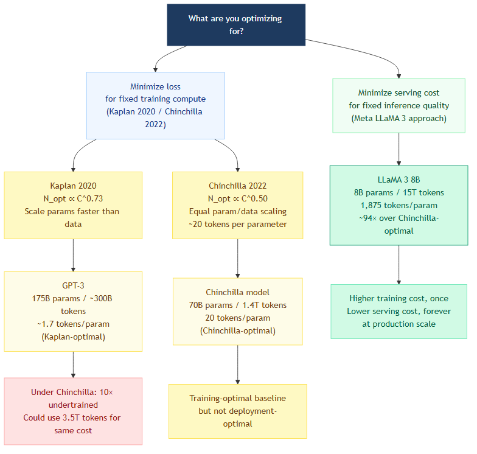
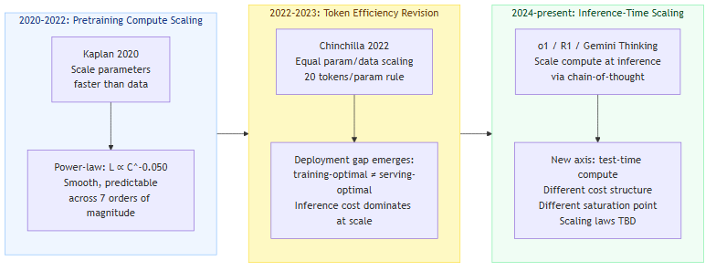

The popular summary of neural language model scaling laws goes something like this: bigger is better, more compute means better performance, and that explains why labs keep spending more.

None of that is wrong. None of it is quite what the papers said.

Kaplan et al.'s 2020 paper is an empirical work about specific exponents in power-law relationships between model loss and three variables: parameter count, training data, and compute. The actual paper is more specific, more limited, and more useful than its popular summary.

---

## What the Paper Actually Measured

Kaplan et al. trained over 200 transformer models spanning compute from 10^18 to 10^23 FLOPs — seven orders of magnitude. They varied one factor at a time, held others fixed, and fitted power-law curves.

Three relationships emerged:

- **Parameter scaling**: L(N) ≈ (N_c/N)^{0.076} — a 10× increase in parameters reduces loss by about 17%
- **Data scaling**: L(D) ≈ (D_c/D)^{0.095} — a 10× increase in training tokens reduces loss by about 22%
- **Compute scaling**: L(C_min) ≈ (C_c/C_min)^{0.050} — a 10× increase in total compute reduces loss by about 11%

The exponents are small. That's the important detail. It means two things simultaneously: scaling reliably works across a huge range (the curves are smooth, not cliffs), and scaling has no miracles (exponential compute buys logarithmic performance gains).

The paper also derived a compute allocation rule: given a fixed budget C, the compute-optimal parameter count scales as N_opt ∝ C^{0.73}. That exponent above 0.5 means as you scale up, put a larger fraction of your budget into parameters than into data. GPT-3 roughly followed this advice — 175B parameters trained on ~300B tokens, or about 1.7 tokens per parameter.

---

## When Chinchilla Changed the Answer

Two years later, Hoffmann et al. at DeepMind ran the same experiment more carefully and reached a different conclusion.

Chinchilla (2022) trained 400+ models using three independent methods to estimate the compute-optimal parameter count. All three converged on the same answer: **N_opt ∝ C^{0.50}**. Parameters and training tokens should scale equally. Rule of thumb: 20 tokens per parameter.

This directly revised Kaplan.

| Model | Parameters | Training Tokens | Tokens/Param |
|-------|-----------|----------------|--------------|
| GPT-3 | 175B | ~300B | ~1.7 |
| Chinchilla | 70B | 1.4T | 20 |

Under Chinchilla's framework, GPT-3 was massively undertrained. Compute-optimal for 175B parameters requires 175B × 20 = 3.5T tokens — GPT-3 used roughly 300B, less than a tenth of what Chinchilla would recommend.

Why did the papers disagree? Methodology. Kaplan's experiments compared models at fixed training step counts without tuning learning rate schedules per scale. Chinchilla's experiments ran each model to convergence at a given compute budget. The difference systematically underestimated data's contribution to the loss in Kaplan's setup.

---

## The Chinchilla Trap

After Chinchilla, "20 tokens per parameter" became the industry reference point. Then the most prominent open-source models largely ignored it.

LLaMA 3 8B was trained on 15T tokens. Chinchilla-optimal for 8B parameters is 8B × 20 = 160B tokens. LLaMA 3 8B used roughly **94× the Chinchilla-optimal token count**.

| Model | Parameters | Training Tokens | Tokens/Param | vs Chinchilla Optimal |
|-------|-----------|----------------|--------------|----------------------|
| Chinchilla (baseline) | 70B | 1.4T | 20 | 1× |
| LLaMA 3 8B | 8B | 15T | 1,875 | ~94× over |
| LLaMA 3 70B | 70B | 15T | 214 | ~11× over |

This wasn't a mistake. It was a deliberate engineering choice based on a different objective.

Chinchilla optimizes: given a fixed compute budget, minimize final loss. Implied assumption: you train once, and you serve a model of that same size for inference.

Production inference doesn't work that way. A 70B model costs roughly 9× more per token to serve than an 8B model. If you overtrain an 8B model with 94× more data, you pay a larger upfront training cost but dramatically lower serving costs across every subsequent inference request. At scale — millions of daily queries — the cumulative serving cost difference dwarfs the training cost difference.

Chinchilla is training-optimal. LLaMA 3 8B is deployment-optimal. Different objectives produce different answers.

*Different optimization targets produce radically different parameter/data allocation decisions.*

---

## What Scaling Laws Can't Predict

Scaling laws model the relationship between compute and *loss*. Loss is a useful proxy but not the same thing as capability. Two limitations matter in practice:

**Emergent abilities.** Wei et al. (2022) documented task capabilities that are essentially zero below a threshold compute level and appear discontinuously once that threshold is crossed. These phase transitions aren't predicted by smooth power-law curves. Most observed emergences cluster around 10^22 to 10^23 FLOPs of total training compute — a range that only the largest models have consistently crossed.

**Task-specific scaling behavior.** The aggregate loss curve is smooth; individual capability curves aren't. Mathematical reasoning scales differently than natural language understanding. Code generation has a different trajectory than long-context retrieval. "Loss is going down" doesn't mean all capabilities improve at the same rate or on the same compute schedule.

---

## The New Scaling Axis

Everything above applies to pretraining-time compute. From 2024, a different axis became relevant.

OpenAI o1 and DeepSeek R1 demonstrated that significant capability improvements could come from scaling *inference-time compute* — giving models more compute to think at runtime, via chain-of-thought generation and verification, rather than adding more parameters trained offline.

Snell et al. (2024) showed that optimally allocated inference-time compute can outperform scaling model parameters for many tasks. The scaling relationship is different: you're trading per-query latency and cost against output quality, not training budget against permanent model capability.

This axis isn't in the 2020 Kaplan framework, which treats inference as a fixed-cost afterthought. Whether the same smooth power-law extrapolation applies to inference-time compute is still an active research question.

*Pretraining compute dominated the 2020–2023 frame; inference-time scaling emerged as a separate axis from 2024.*

---

## What Remains True

After Chinchilla's revision, after LLaMA 3's deployment-optimal overtraining, after inference-time scaling: Kaplan 2020's core claim holds.

Model loss follows smooth, predictable power-law relationships with parameter count, training data, and compute across multiple orders of magnitude. This enables reliable extrapolation — train small models, measure their loss curves, forecast what a larger model will achieve before spending the budget to build it. That's what changed how large language model development works: not "scale and hope," but "plan, predict, scale."

What "scaling" means has become considerably more complicated. The scaling laws themselves remain empirically solid.

---

## References

1. Kaplan, J., McCandlish, S., Henighan, T., Brown, T. B., Chess, B., Child, R., ... & Amodei, D. (2020). *Scaling Laws for Neural Language Models*. arXiv:2001.08361.

2. Hoffmann, J., Borgeaud, S., Mensch, A., Buchatskaya, E., Cai, T., Rutherford, E., ... & Sifre, L. (2022). *Training Compute-Optimal Large Language Models*. arXiv:2203.15556.

3. Wei, J., Tay, Y., Bommasani, R., Raffel, C., Zoph, B., Borgeaud, S., ... & Fedus, W. (2022). *Emergent Abilities of Large Language Models*. *Transactions on Machine Learning Research*. arXiv:2206.07682.

4. Meta AI. (2024). *The Llama 3 Herd of Models*. arXiv:2407.21783.

5. Snell, C., Lee, J., Xu, K., & Kumar, A. (2024). *Scaling LLM Test-Time Compute Optimally is More Effective than Scaling Model Parameters*. arXiv:2408.03314.

6. Hagele, A., Flux, M., & Schölkopf, B. (2024). *Scaling Laws and Compute-Optimal Training Beyond Fixed Training Durations*. arXiv:2405.18392.
